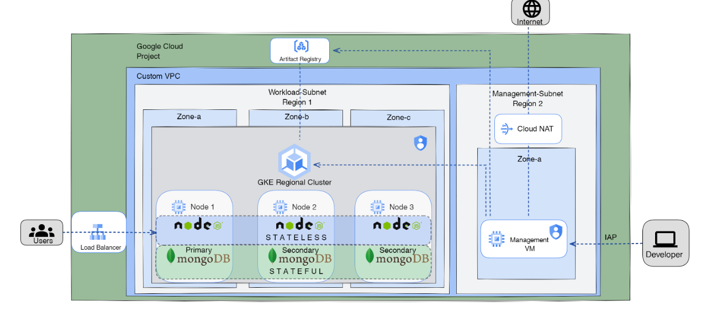

# Infrastructure as Code with Terraform on Google Cloud Platform (GCP)

This project demonstrates how to create a robust infrastructure on Google Cloud Platform using Terraform modules. The infrastructure includes IAM settings, a network setup, compute resources, and a MongoDB replica set, along with a Node.js web app that connects to the database. The web app is exposed using an ingress/load balancer. Here's a step-by-step guide on how to use this repository to set up your own infrastructure.



## Table of Contents
- [Prerequisites](#prerequisites)
- [Getting Started](#getting-started)
  - [Terraform Modules](#terraform-modules)
- [Usage](#usage)
- [Contributing](#contributing)
- [License](#license)
- [Cleanup](#cleanup)

## Prerequisites

Before you begin, make sure you have the following tools and resources set up:

- [Terraform](https://www.terraform.io/) installed.
- [Google Cloud SDK](https://cloud.google.com/sdk) installed and configured.
- A Google Cloud Platform (GCP) account with billing enabled and a Project.
- A GitHub account for version control (optional but recommended).

## Getting Started

Clone this repository to your local environment to start setting up the infrastructure.

```bash
git clone https://github.com/muhammad-osama-dev/gcp-nodejs-mongodb-deployment.git
cd gcp-nodejs-mongodb-deployment
```
Install Google Cloud SDK if you haven't already

```bash
sudo apt-get install google-cloud-sdk-gke-gcloud-auth-plugin
gcloud auth login
gcloud projects list
gcloud config set project PROJECT_ID
```

Create a Service account for terraform through gcloud or console 

```bash
gcloud iam service-accounts create SERVICE_ACCOUNT_NAME --display-name "DISPLAY_NAME"
gcloud projects add-iam-policy-binding YOUR_PROJECT_ID --member=serviceAccount:SERVICE_ACCOUNT_EMAIL --role=roles/editor
```
For example

```bash
gcloud iam service-accounts create SERVICE_ACCOUNT_NAME --display-name "my-service-account"
gcloud projects add-iam-policy-binding my-gcp-project --member=serviceAccount:my-service-account@my-gcp-project.iam.gserviceaccount.com --role=roles/editor
```
Create a key for the service account 

```bash
gcloud iam service-accounts keys create KEY_FILE.json --iam-account SERVICE_ACCOUNT_EMAIL
```

### Terraform Modules

I've organized the infrastructure as code into Terraform modules for easier management and reusability. In the modules directory, you will find modules for IAM, network, compute, and storage. Customize the input variables such as project_id(use your project id), region1(cluster region), region2(managment vm region), vpc name .. etc in the terraform.tfvars file in the root directory to match your requirements

## Usage

make sure you are in gcp-nodejs-mongodb-deployment directory 

apply infrastructure using terraform

```bash
terraform apply 
```
takes around 20-40m to apply so play chess game or something 

after applying you can check progress through managment vm 
ssh to the machine using gcloud and iap

```bash
gcloud compute ssh my-private-instance --zone=us-east1-b --tunnel-through-iap --project=PROJECT_ID
```
these are the default vales if you changed the variables adjust according to that 

```bash
watch cat /tracker.txt
```
wait till it looks something like that

```bash
Installing Docker ...
Pulling app image ...
Image Pulled ...
Image Pushed
Pulling mognodb image ...
Pulled mognodb image ...
Pushing mognodb image ...
Image Pushed ...
kubectl installed ...
google auth ...
tiny proxy installed ...
service restarted auth ...
```

your infrastructure is up 

now we should be able to proxy to the managment vm and apply the kubernetes manifests

to use the vm as a proxy on your local machine

```bash
gcloud container clusters get-credentials gke-cluster --zone=us-central1 --project halogen-data-401020 --internal-ip
gcloud compute ssh my-private-instance \
    --tunnel-through-iap \
    --project=halogen-data-401020 \
    --zone=us-east1-b \
    --ssh-flag="-4 -L8888:localhost:8888 -N -q -f"
export HTTPS_PROXY=localhost:8888
```
try

```bash
kubectl get ns 
```
if it shows your namespaces then you are good to go 

applying kubernetes manifests

```bash
kubectl get nodes 
kubectl get apply ./kubernetes/mongodb
kubectl get apply ./kubernetes/app_deployment 
```
to see the pods deployed

```bash
kubectl get po -n staging  
kubectl get po -n database  
```
getting service ip to access the application 

```bash
watch kubectl get svc -n staging  
```
if it's pending wait a bit for it to accuire the ip

you are good to go Happy devopsing :)


## Cleanup
To delete the resources and clean up your GCP project:

Run the following Terraform command to destroy the infrastructure:
```bash
terraform destroy
```
When prompted, confirm that you want to destroy the resources.
This will remove all the resources created by Terraform. Be cautious, as this action is irreversible.

Optionally, delete the service account and associated key, if no longer needed:
```bash
gcloud iam service-accounts delete SERVICE_ACCOUNT_EMAIL
```
Don't forget to delete the GCP project if you created a separate one for this project.

Happy cloud adventures 😊🚀


## Contributing

We welcome contributions from the community! If you'd like to contribute to this project, please follow these guidelines:

1. Fork the project and create your branch for your contribution.
2. Make your changes and ensure they align with the project's goals.
3. Test your changes to avoid introducing new issues.
4. Submit a pull request (PR) with a clear description of your changes.

We appreciate your contributions and will review PRs promptly. If you have questions or need assistance, please open an issue or contact us at [contact@example.com](mailto:contact@example.com).

By contributing to this project, you agree to abide by the [Code of Conduct](CODE_OF_CONDUCT.md).

## License

This project is licensed under the [MIT License](LICENSE). You can find the full text of the license in the [LICENSE](LICENSE) file.


